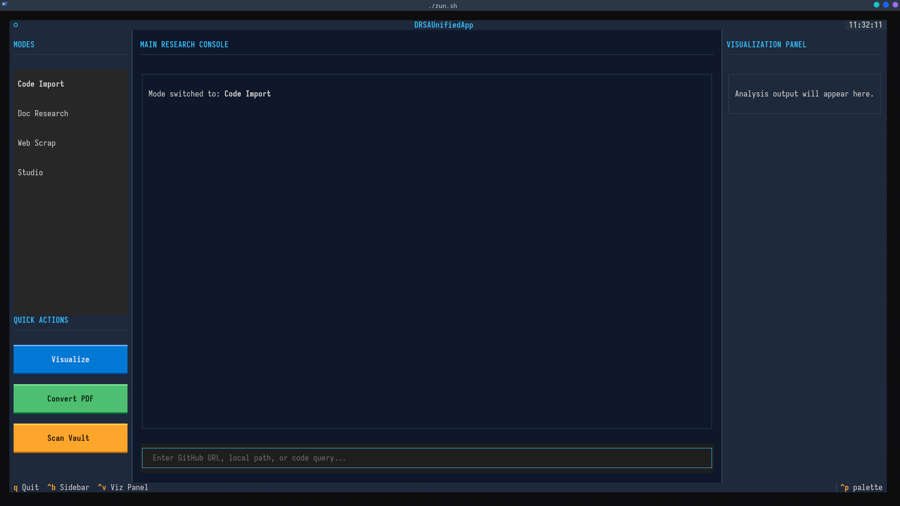

# 

  

# DRSA

**DRSA** is a terminal-based Research tool which i am creating for deep codebase analysis, technical document parsing, and automated web research. It transforms terminal into a power Technical Research Place for knowledge work.

---

## Key Features

| Feature               | Description                                                | Modes               |
| :-------------------- | :--------------------------------------------------------- | :------------------ | ------------------------------- |
| **Code Intelligence** | Deep indexing with LlamaIndex and Tree-Sitter.             | `Code Import`       | **Currently in Building phase** |
| **Doc Analysis**      | High-fidelity parsing of PDFs and Office docs (Magic-PDF). | `Doc Research`      | **Currently in Building phase** |
| **Web Research**      | AI-driven web scraping via Crawl4AI and SearXNG.           | `Web Scrap`         | **Working**                     |
| **Expert Synthesis**  | Cyclic reasoning agents powered by LangGraph.              | `Studio Mode`       |
| **Visual Graphs**     | Auto-generated Mermaid diagrams and Knowledge Graphs.      | Sidebar / Viz Panel |
| **Notebook**          | Planning to Add                                            |

### Local Directory Indexing

Also Local directory Codebase Scanning and asking question....

---

## Command Shortcuts

| Key        | Action                                      |
| :--------- | :------------------------------------------ |
| `CTRL + B` | Toggle Left Sidebar (Modes & Quick Actions) |
| `CTRL + V` | Toggle Right Visualization Panel            |
| `Q`        | ❌ Quit Application                         |
| `ENTER`    | Submit Query / Load Path                    |

---

## Architecture Under the Hood

- **Frontend**: Textual TUI (Modern CSS-based layouts)
- **Database**: LanceDB (Vector store for fast retrieval)
- **Agents**: LangGraph (Cyclic reasoning state machine)
- **Parsers**:
  - Source Code: Tree-Sitter (grammar-aware)
  - Documents: Marker / Magic-PDF

## Documentation & Vault

All indexed knowledge is stored in the `./lancedb_vault`. You can use the **Scan Vault** button in the sidebar to view current indexed tables and statistics.

---
